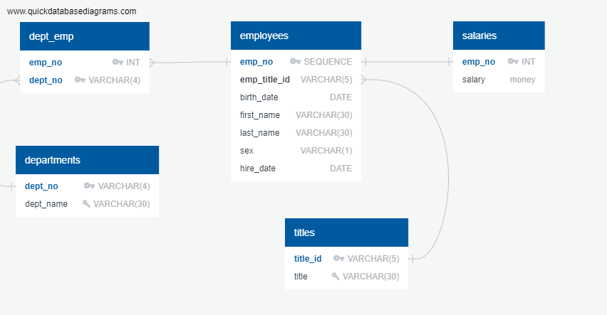
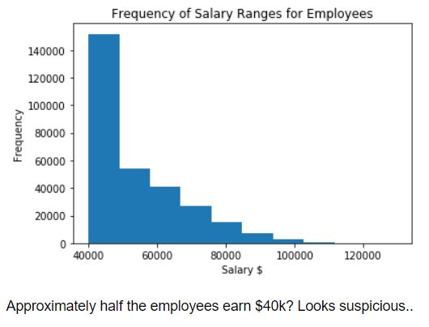
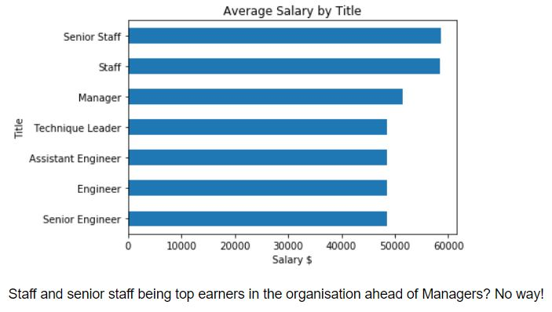

# sql-challenge - Employee Database: A Mystery in Two Parts
 Jamie Tan submission on sql-challenge

# Background
It is a beautiful spring day, and it is two weeks since you have been hired as a new data engineer at Pewlett Hackard. Your first major task is a research project on employees of the corporation from the 1980s and 1990s. All that remain of the database of employees from that period are six CSV files.
In this assignment, you will design the tables to hold data in the CSVs, import the CSVs into a SQL database, and answer questions about the data. In other words, you will perform:

1. Data Engineering

2. Data Analysis

# Data Engineering

# Data Analysis
Data analysis performed in files:

1. analysis_queries.sql
2. table_schemata.sql

# Bonus Analysis
Proving that the dataset is fake. 

